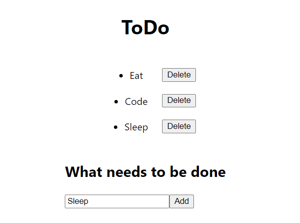
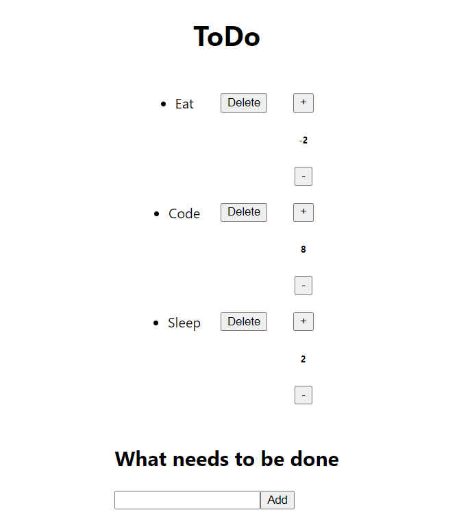

## Functional and class component HW

Follow these steps:
* Create a simple to-do app using React. A user should be able to enter the task items that get displayed as a to-do list in your app. 

* The user will be able to delete specific task

* Use state to create counter for each task

